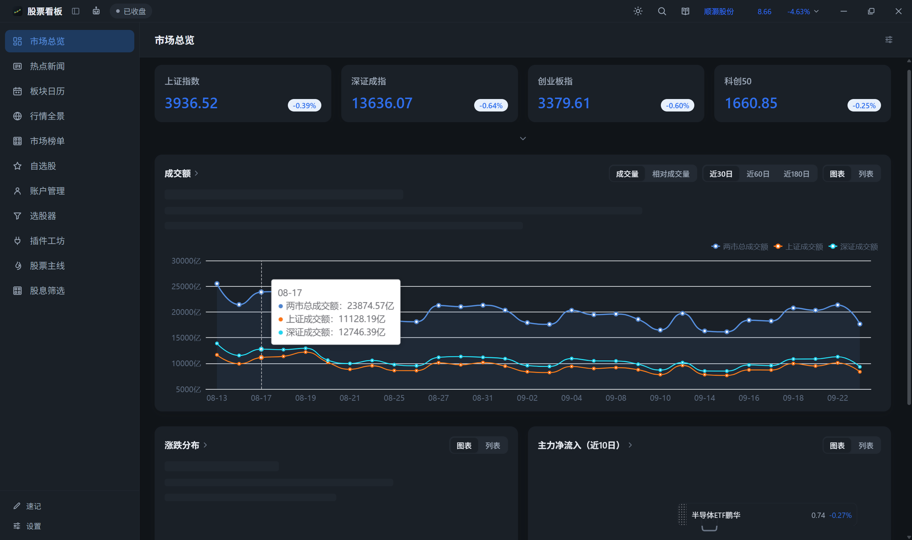
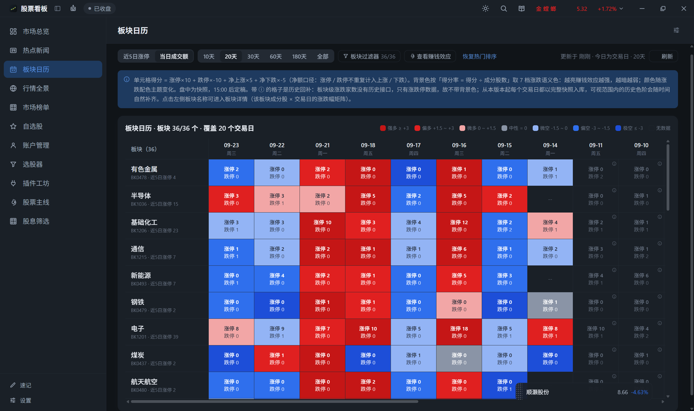
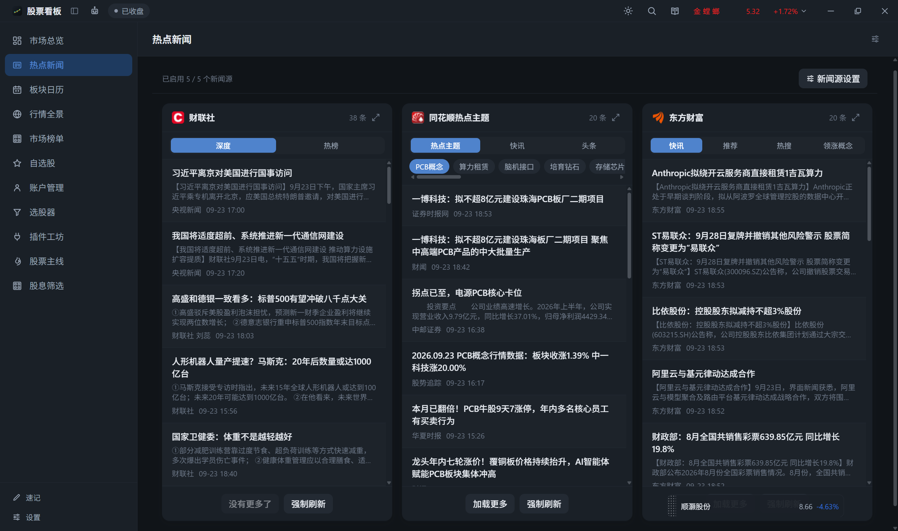
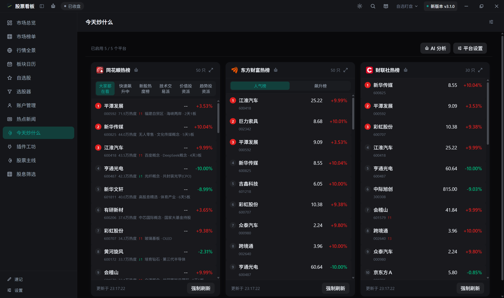
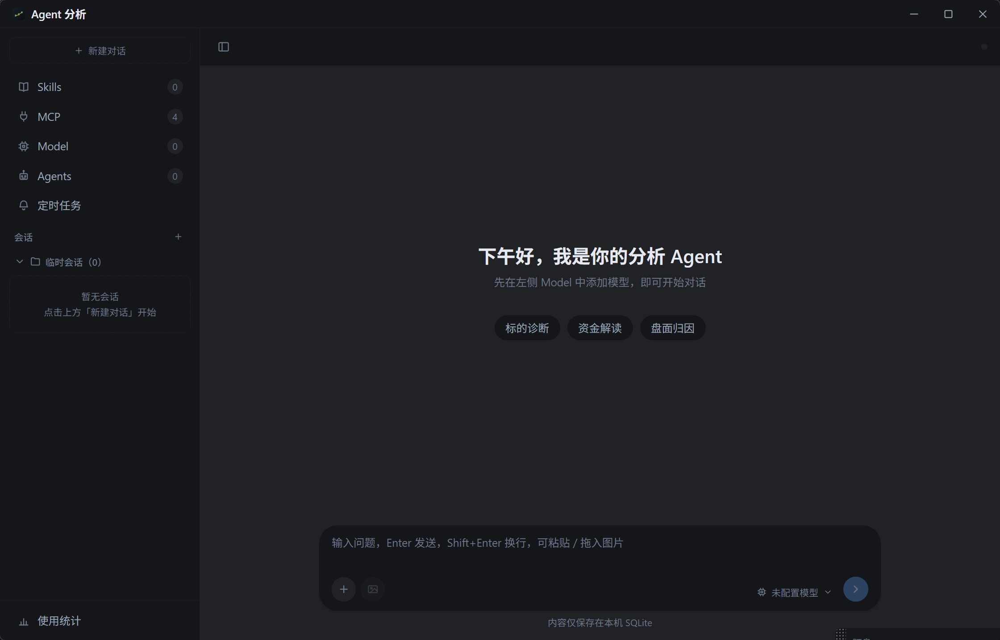

# whf-stock-board

A 股看板 SPA（个人学习用）：行情总览 / 自选股 / 行情全景 / 资金动向 / 涨停异动 / 龙虎榜·大宗 / 今天炒什么（五平台热股榜聚合）。

- **PC 客户端（推荐）**：Tauri 2 打包的 Windows 桌面应用，全部数据源可用（Rust 直连，无 CORS 限制）
- **安卓客户端（开发中）**：同一代码库的移动端形态，底部三 Tab（热点新闻 / 今天炒什么 / 我的），Vant 4 组件库，直装 APK 无需商店

## 软件截图

**市场总览**：大盘核心指数与全球指数报价卡、涨跌分布、大盘资金流（图表 / 列表两种展示可切换）、板块热力图（热力图 / 列表两视图，支持下钻板块）、成交额趋势；交易时段自动轮询刷新，点击个股 / 板块直接打开详情



**板块日历**：以「日期 × 板块」日历矩阵呈现各板块每日热度评分（赚钱效应），支持区间与热度口径切换、板块显隐 / 排序 / 筛选；点击格子查看当日板块明细，并内嵌赚钱效应气泡图辅助横向对比



**热点新闻**：新浪 / 同花顺 / 东方财富 / 澎湃 / 财联社 / 通达信六源横向卡片流，每源卡片保留各自的子视图（快讯 / 热榜 / 热搜 / 领涨概念等）；点击条目在新窗口打开原文，右上角可放大为两列宽版弹窗；「新闻源设置」勾选显隐 + 拖拽排序并持久化；「AI 分析」抓取新闻正文后投递 Agent 解读利好 / 利空板块与个股



**今天炒什么**：同花顺 / 东方财富 / 财联社 / 通达信 / 雪球五平台热股榜单聚合，每张卡片保留该平台自己的榜单分组切换；点击榜单行直接打开个股详情，顶部「AI 分析」把当前启用平台的榜单投递给 Agent 解读，「平台设置」可勾选显隐与拖拽排序



**Agent 分析**：内置 AI 分析 Agent（独立桌面窗口），多轮对话解读盘面与个股；左栏提供会话树 / 定时任务 / 使用统计，模型、技能、MCP 工具、Agent 人格四类管理弹窗均可视化 CRUD；Agent 可调用内置 MCP 工具取行情、查本地数据库，全站「AI 分析」入口（市场榜单 / 热点新闻 / 今天炒什么等）的结果都投递到该窗口



**插件工坊**：插件体系的自省与管理窗口（宿主自带页面，本身不是插件）：内核概览、插件清单（启停 / 安装 / 卸载，支持 zip 包安装第三方插件）、贡献点总览、生效服务与最近事件流；页面不可停用，插件页随插件撤销时作为稳定的兜底落点

## 技术栈

Vue 3.5 + TypeScript + Vite + vue-router + Pinia + ECharts + Tailwind CSS 4，数据源 [stock-sdk](https://stock-sdk.linkdiary.cn/)（腾讯 / 东方财富）；PC 客户端壳为 Tauri 2。AI 编码代理请先阅读根目录 [AGENTS.md](./AGENTS.md)。

## 开发方式

环境要求：Node 24+ / pnpm 12 / Rust（stable，msvc 目标）+ MSVC C++ 桌面开发套件（仅 Tauri 相关需要）。

```bash
pnpm install
pnpm dev          # 浏览器开发（含 /stock-proxy 本地代理中间件，解决东财 CORS）
pnpm tauri dev    # PC 客户端开发（自动起 vite 并打开桌面窗口；数据经 Rust 直连，无 CORS）
pnpm lint         # ESLint
pnpm vue-tsc -b   # 类型检查
```

> 客户端数据通道：`src/api/proxy-fetch.ts` 按运行环境自动切换——Tauri 内经
> `tauri-plugin-http` 由 Rust 直连（无 CORS，域名白名单见
> `src-tauri/capabilities/default.json`）；浏览器内走同源 `/stock-proxy` 代理。

## 打包方式

```bash
# 浏览器产物（GitHub Pages 用）
pnpm build

# PC 客户端安装包（Windows：msi + nsis setup.exe，产出在 src-tauri/target/release/bundle/）
pnpm tauri build
```

- `tauri build` 会先执行 `pnpm build`（tauri.conf.json 的 beforeBuildCommand）再编译 Rust 并打包
- 版本号以 `src-tauri/tauri.conf.json` 的 `version` 为准（与安装包文件名、Release 版本一致）
- 本机构建 WiX / NSIS 工具链需下载，国内网络建议先设置代理：
  `export HTTPS_PROXY=http://127.0.0.1:7897`

## 安卓客户端（移动端）

与桌面端共用同一代码库（数据层 / API / 常量完全复用），通过 Vite `--mode mobile` 构建期分流：
移动端入口挂载 `src/mobile/`（底部 TabBar 壳 + 移动页面），桌面入口与布局完全不受影响；
组件库使用 [Vant 4](https://vant-ui.github.io/vant/)（Swipe 横滑切换 / PullRefresh 下拉刷新 / List 上拉加载），主题经 CSS 变量桥接 `DESIGN.md` token。

```bash
pnpm dev:mobile    # 移动端前端开发（浏览器预览，mode=mobile）
pnpm tauri android dev    # 真机 / 模拟器开发（需 Android SDK + NDK + Rust android targets）
pnpm tauri android build --apk    # 打安卓 APK（直装分发，产出在 src-tauri/gen/android/...）
```

- 移动端仅保留两个数据 Tab 与「我的」（设置 / 主题设置），桌面专属能力（AI 分析 / 停靠面板 / 插件 / 自选）不打包
- CI：`mobile-release.yml` 与桌面 `release.yml` 共用同一版本 tag，自动把 APK 追加到同一个 GitHub Release
- 数据同样经 Rust 直连上游（无自建后端）；榜单与新闻快照 30 分钟 TTL 持久化缓存，前台轮询间隔可在 App 内设置

## 发布到 GitHub Release

发布由 GitHub Actions（`.github/workflows/release.yml`）自动完成，无需手工上传：

```bash
# 1. 更新 src-tauri/tauri.conf.json 中的 version（如 0.1.0 -> 0.2.0）
# 2. 提交代码
git commit -am "release: v0.2.0"
# 3. 打 tag 并推送
git tag v0.2.0
git push origin main v0.2.0
```

CI 会在 Windows runner 上自动构建，并创建同名 GitHub Release（`v0.2.0`）上传安装包：

- Release 页面：https://github.com/WHF293/whf-stock-board/releases
- 最新版固定链接：https://github.com/WHF293/whf-stock-board/releases/latest

## 更新方式

- **覆盖安装（当前支持）**：下载新版安装包直接运行即可升级，无需卸载；
  自选股 / 设置 / 主题等数据存于 WebView2 用户数据目录（`%LOCALAPPDATA%/cn.whf.stockboard/`），升级不影响
- **应用内自动更新（未启用）**：Tauri 官方支持 updater 插件（`tauri-plugin-updater` +
  更新签名密钥 + Release 里的 `latest.json`），客户端可启动时检查新版本并一键覆盖升级；
  需要时按官方文档开启即可

## 插件体系

应用内置一套轻量插件内核（`src/plugin/`），能力不再写死在宿主里——**侧栏面板、菜单、路由、右侧停靠面板、命令（含全局快捷键）、Agent 工具**都可以由插件贡献，装/卸/启/停即刻生效且完全可逆。

- **启停入口**：设置页 → 「插件」卡片，可逐个启用/禁用（禁用状态记在本地，插件卸载后其贡献点全部消失）
- **官方插件走「应用内安装」**（`dsh-mainline` 股票主线 / `dsh-dividend-screen` 股息筛选 / `dsh-quick-note` 速记 / `dsh-sidebar-watch` 自选盯盘）：
  源码、清单与 zip 产物包都在**独立仓库 [jx62257070/tauri-plugin](https://github.com/jx62257070/tauri-plugin)**（`whf-stock-board-plugin`），本仓库 `src/plugins/` 下**没有任何插件源码**
  （`BUILTIN_PLUGINS` 是空数组）—— 因此它们在应用里能正常安装 / 卸载，升级也只是再装一次新版本的包
- **插件工坊**（左侧导航最后一项）是**应用自带页面而不是插件**：可视察当前插件清单、贡献点、服务与事件流，并直接启停 / 安装 / 卸载插件；正因它不可停用，插件页面被停用撤销时有稳定的退回落点
- **开放给插件的 API**（九个贡献点、`ctx.storage` / `ctx.db` / `ctx.settings`、十六个宿主服务与六个内置事件、配额与红线）见 **[PLUGIN_API.md](./PLUGIN_API.md)**；
  其中「契约层」也对**应用内安装的第三方插件**开放（第三层「宿主内部模块」仅源码级插件可用 —— 第三方插件是运行时动态加载的，`import` 一律不可用，实测结论见该文档 §0）；
  第三方要写有状态的界面与取数，宿主已代为下发：`ctx.vue`（渲染运行时）、`app:ui`（宿主 UI 组件 + 确认弹窗）、`app:http`（受白名单约束的请求）、`app:quotes`（批量报价）
- **第三方插件作者请看 [PLUGIN_WIKI.md](./PLUGIN_WIKI.md)**：面向「应用内安装」作者的独立 wiki（能力边界、九大贡献点、十六个服务、数据通道、渲染函数速成、五个可抄示例、排障对照表）。`PLUGIN_API.md` 那份面向宿主仓库贡献者，含第三层宿主内部模块
- **依赖靠服务名**：插件 `inject: ['note:repo']` 声明依赖，未就绪时静默等待、就绪后自动挂载；依赖被禁用则级联暂停，恢复后自动重挂（环形依赖停在等待态，不死循环）

自己写一个插件（例如左侧栏新增面板）只需三步：建目录 `src/plugins/<id>/` 写 `plugin.ts` 与面板组件 → 在 `src/plugins/index.ts` 的 `BUILTIN_PLUGINS` 登记 → 无需改任何宿主代码。字段与约定详见 [AGENTS.md](./AGENTS.md) 的「插件体系」一节。
（注意：这样写出来的仍是**源码集成**插件，随应用分发、应用内卸载不了。想做成可卸载的插件包 —— 官方四个插件就是这么做的 —— 要把源码放到插件仓库 [jx62257070/tauri-plugin](https://github.com/jx62257070/tauri-plugin) 的 `plugins/<id>/` 里出包。）

## 开发说明

本项目（包括全部前端页面、组件、API 层、工程化配置与本文档）由 AI 编码代理 **ZCode** 驱动模型 **GLM-5.3-Flash**（智谱）全程实现，人类仅负责提出需求与验收。

## 说明

- 数据仅供个人学习参考，不构成投资建议
- 行情自动刷新仅在交易时段轮询（A 股 09:15–15:00；美股 21:30–24:00 与 00:00–04:00），非交易时段仅进入页面时请求一次
- 网页版（GitHub Pages）已关闭：静态托管无法代理东财接口导致数据残缺，PC 客户端全量数据可用
